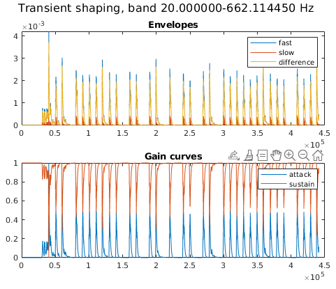
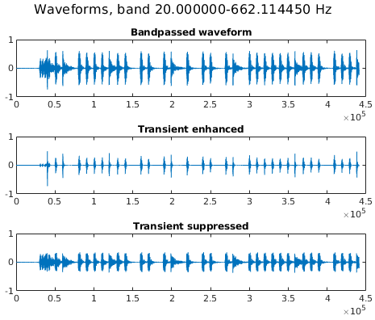
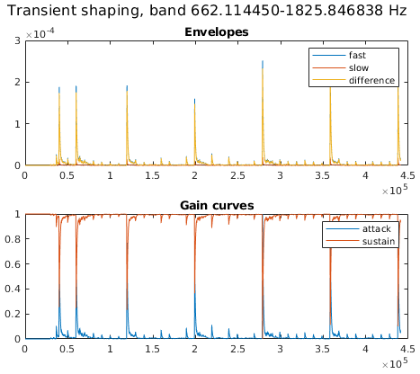
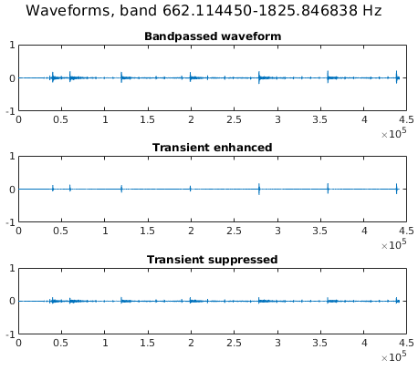
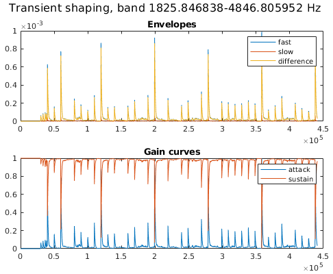
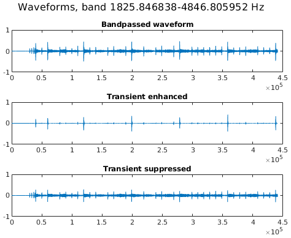
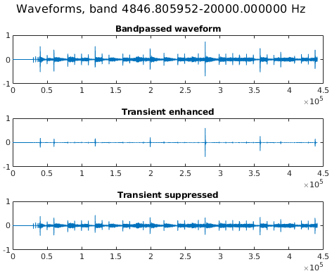
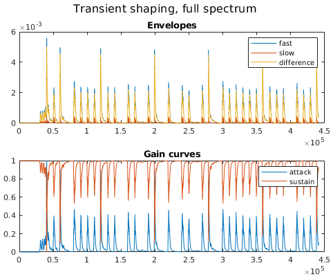
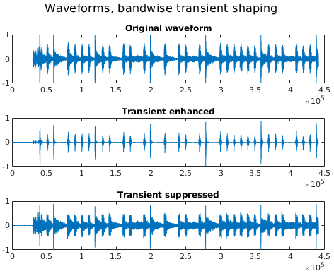
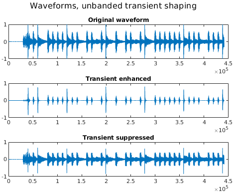

# Bark-scale multi-band transient shaper

This is an implementation of the SPL differential envelope transient shaper. Resources I used to develop it:
* [SPL Transient shaper design manual](https://spl.audio/wp-content/uploads/transient_designer_2_9946_manual.pdf). Read more from the creator: [story part 1](https://www.elysia.com/transient-designer-story/), [story part 2](https://www.elysia.com/transient-designer-story-part-2/)
* Audio Toolkit articles: [1](https://blog.audio-tk.com/2015/06/30/audio-toolkit-anatomy-of-a-transient-shaper/), [2](https://blog.audio-tk.com/2016/06/21/2946/). Old code from [Audio Toolkit](https://github.com/mbrucher/AudioTK/search?q=transient&type=commits)
* [HackAudio Ch 17](https://github.com/HackAudio/textbookcode/tree/master/Ch_17) code examples
* [KVR forum discussion](https://www.kvraudio.com/forum/viewtopic.php?t=466276)

### Introduction

Traditional dynamic range compressors and expanders have too many parameters. A transient shaper creates a similar effect using relative transient attacks from the input sound file.

The method is the SPL differential envelope applied across 24 Bark frequency bands, with roughly these steps:
1. Bandpass the input signal into 24 frequency bands on the Bark scale (20-20,000 Hz)
2. For each band, compute the derivative of the power of the band-passed signal
3. Compute fast and slow attack-release envelopes from the derivative of the power. **n.b.!** these can be configured per band if desired. Defaults are: fast attack = 1ms, slow attack = 15ms, release = 20ms.
4. The attack gain is the difference between the attack and release envelopers, normalized to [0, 1]
5. The sustain gain is the inverse of the attack gain (1 - attack gain)
6. Apply the desired gain curve (attack, sustain) on the band-passed signal
7. Sum all transient-enhanced (or -suppressed) 24 band-passed signals to produce the final, transient-sculpted audio

There are [MATLAB](./matlab) and [Python 3](./python) implementations.

#### What's it for?

The transient shaper is related to dynamic range  compressors, expanders, limiters, and noisegates - exactly how is not my forte, I'm not an audio engineer. I use the transient enhancer/attack gain curve creates a noise-gate-like effect, making it potentially useful for enhancing strong percussive beats for futher MIR algorithms (e.g. beat tracking). You should listen for yourself to see if you'll find this useful.

#### Results, audio clips

Table of audio clip results on a mixed song (first 10 seconds of [Misha Mansoor & Tosin Abasi - Optimist](https://www.youtube.com/watch?v=T4gTgM0UepQ)) and drum track (first 10 seconds of Periphery - The Bad Thing):

| Type | Input clip | Unbanded transient enhanced | Unbanded transient suppressed | Banded transient enhanced | Banded transient suppressed |
|---|--------|--------|--------|-----|-----|
| Mix |  |  |  |  |  |
| Drum track |  |  |  |  |  |

As an example of combining this with other algorithms, here's a chain of [Harmonic-Percussive Source Separation](https://github.com/sevagh/Real-Time-HPSS/blob/master/matlab/HPSS.m) + multiband transient enhancer (applying the attack gain curve) to create a cleanly gated drum beat extraction of the mixed audio clip above:

 

Note that while it doesn't sound perceptually great, the result is a very good separation of percussive beats from the mix.

### Results on drum track, plots

There is a script variant with intermediate steps plotted, using only 4 frequency bands instead of all 24 for illustrative purposes.

Banded envelopes and intermediate waveforms:

 
 
 
 

Unbanded/full spectrum envelopes:

Final waveforms, banded vs. unbanded:

 
